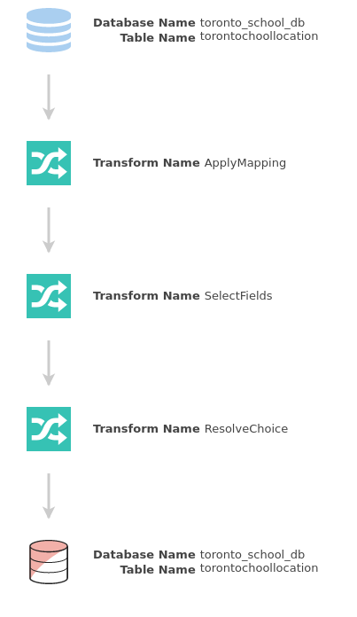

# ETL_with_AWS_Glue

## End-to-end ETL on AWS Glue
### Steps to do in AWS Service UI:

 Creating IAM Roles, Policy

 Upload Toronto school location data to S3

 Create redshift db and add connection

 Add a crawler to connect with Toronto school S3 object, be sure to add S3 policy to the Gluerole

 Create a toronto_school_db and set update frequency

 

